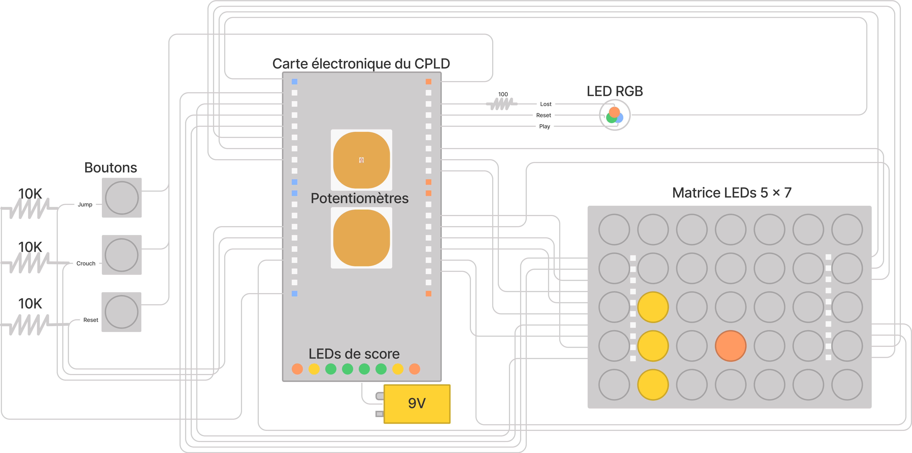
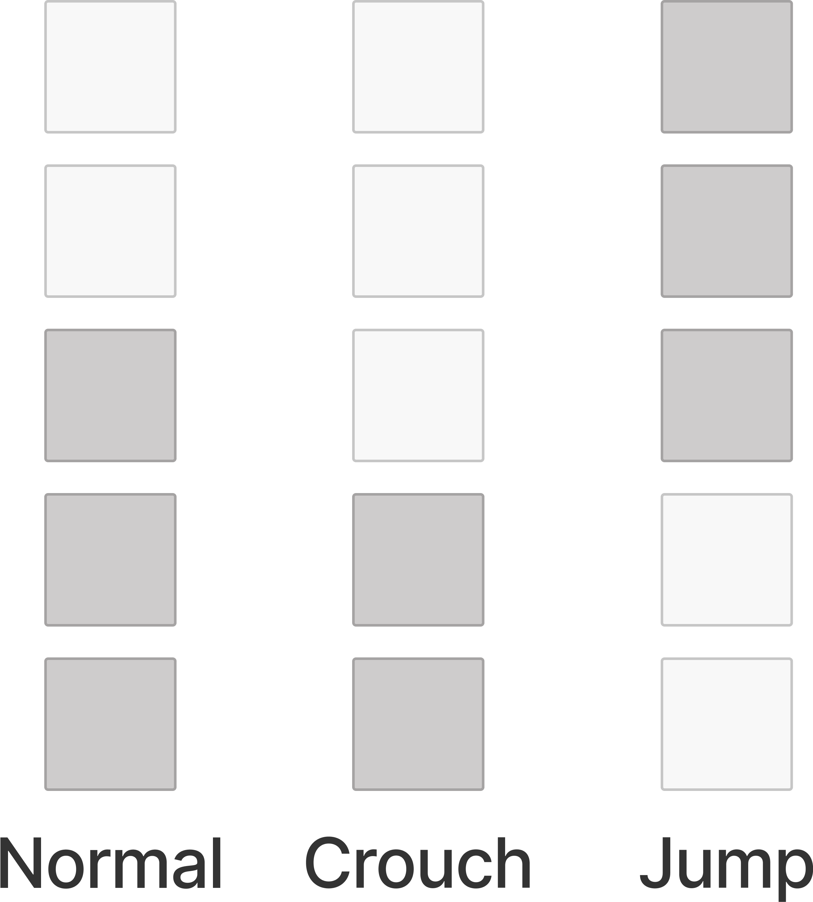
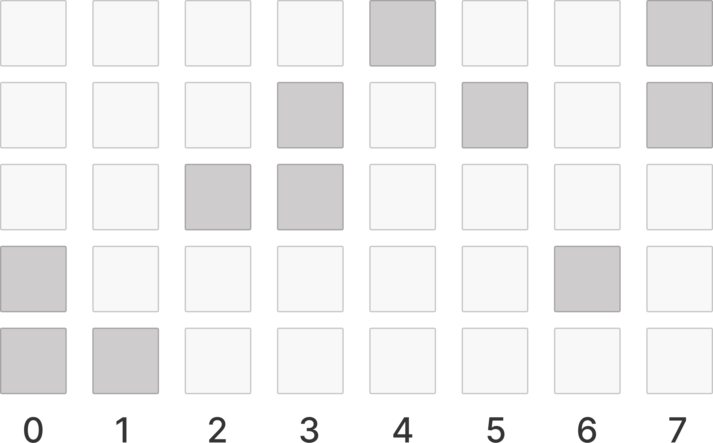

# Dino-LED in VHDL

This project has been made in the scope of the course "Digital Electronics" given at the University of Liège during the 2020-2021 academic year.  
The goal of this project is to implement a dino chrome on a 7*5 led matrix using a CPLD.

## Report

The report (in French) of this project can be found in [report.pdf](./report.pdf)

### Components

- CPLD board,
- 5 x 7 LED matrix,
- Buttons for :
  - Crouch,
  - Jump,
  - Reset,
- 8 scores LEDs (on the CPDL board),
- 1 RGB LED:
  - Red: Game Over,
  - Blue: Game On,
  - Green: Resetted game.

### Electrical schematic

### Dino and obstacles representations

The dino and the obstacles are represented by vertical blocs, over 5 blocs as the LED matrix is 7*5.

#### Dino

.

#### Obstacles

